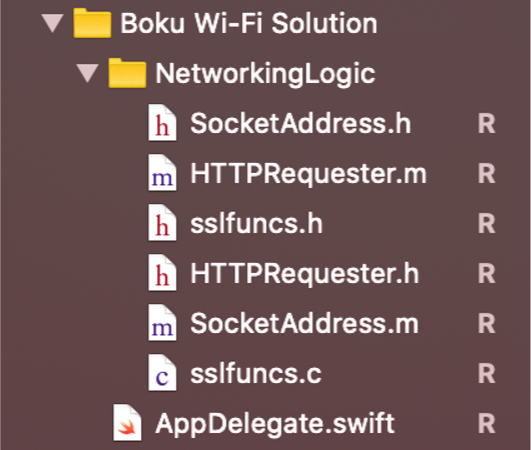

# Boku iOS WiFi Solution

To use the Boku Authenticate solution with WiFi and an iOS application, please follow the below instructions. As always, for more information, visit our full developer website here: https://developer.boku.com/docs/identity-getting-started

1: Add the NetworkingLogic folder, which contains six files to the project folder. Shown below.



2: Include `#import "HTTPRequester.h"`  in the Swift bridging header file.

3: Include `func requestEvurlWithCellularData(url:String) -> String` as a member function in the View Controller that fires the EVURL. The function definition is located in `EvurlRequestWithCellularData.swift`

4: Fire the EVURL as shown below. An EVURL should be passed for the `url` parameter. 

```swift
override func viewDidLoad() {
    super.viewDidLoad();

    let evurl = "https://api.boku.com/whatever";

    _ = requestEvurlWithCellularData(evurl: EVURL) 
}
```